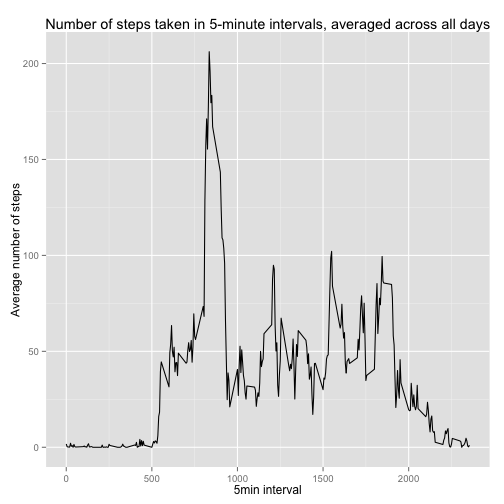
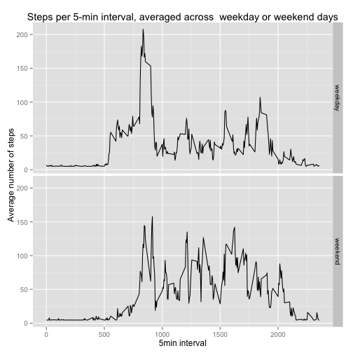

---
output:
  html_document:
    keep_md: yes
---
# Reproducible Research: Peer Assessment 1


```r
setwd("~/RepData_PeerAssessment1")
library(ggplot2)
```

## Loading and preprocessing the data
1) Read the zipped data

```r
data <- read.csv(unz("activity.zip", "activity.csv"), header=TRUE)
str(data)
```

```
## 'data.frame':	17568 obs. of  3 variables:
##  $ steps   : int  NA NA NA NA NA NA NA NA NA NA ...
##  $ date    : Factor w/ 61 levels "2012-10-01","2012-10-02",..: 1 1 1 1 1 1 1 1 1 1 ...
##  $ interval: int  0 5 10 15 20 25 30 35 40 45 ...
```
2)
Make the date variable into a date

```r
data$date <- as.Date(data$date)
str(data)
```

```
## 'data.frame':	17568 obs. of  3 variables:
##  $ steps   : int  NA NA NA NA NA NA NA NA NA NA ...
##  $ date    : Date, format: "2012-10-01" "2012-10-01" ...
##  $ interval: int  0 5 10 15 20 25 30 35 40 45 ...
```

```r
summary(data)
```

```
##      steps            date               interval   
##  Min.   :  0.0   Min.   :2012-10-01   Min.   :   0  
##  1st Qu.:  0.0   1st Qu.:2012-10-16   1st Qu.: 589  
##  Median :  0.0   Median :2012-10-31   Median :1178  
##  Mean   : 37.4   Mean   :2012-10-31   Mean   :1178  
##  3rd Qu.: 12.0   3rd Qu.:2012-11-15   3rd Qu.:1766  
##  Max.   :806.0   Max.   :2012-11-30   Max.   :2355  
##  NA's   :2304
```

Make a new data frame for total daily steps.

```r
dailysteps <- aggregate(steps ~ date, data, sum)
str(dailysteps)
```

```
## 'data.frame':	53 obs. of  2 variables:
##  $ date : Date, format: "2012-10-02" "2012-10-03" ...
##  $ steps: int  126 11352 12116 13294 15420 11015 12811 9900 10304 17382 ...
```

```r
summary(dailysteps)
```

```
##       date                steps      
##  Min.   :2012-10-02   Min.   :   41  
##  1st Qu.:2012-10-16   1st Qu.: 8841  
##  Median :2012-10-29   Median :10765  
##  Mean   :2012-10-30   Mean   :10766  
##  3rd Qu.:2012-11-16   3rd Qu.:13294  
##  Max.   :2012-11-29   Max.   :21194
```

## What is mean total number of steps taken per day?
1) Make a histogram of steps each per day.


```r
hist(dailysteps$steps, main = "Histogram of steps per day", xlab="Steps")
```

 

2) Calculate the mean and median total steps per day.


```r
dailysteps.mean <- mean(dailysteps$steps, na.rm=T)
dailysteps.median <- median(dailysteps$steps, na.rm=T)
```

The mean number of steps is **10766**

The median number of steps is **10765**

## What is the average daily activity pattern?

Summarise the data  

```r
activity <- aggregate(steps ~ interval, data, mean)
str(activity)
```

```
## 'data.frame':	288 obs. of  2 variables:
##  $ interval: int  0 5 10 15 20 25 30 35 40 45 ...
##  $ steps   : num  1.717 0.3396 0.1321 0.1509 0.0755 ...
```

```r
summary(activity)
```

```
##     interval        steps       
##  Min.   :   0   Min.   :  0.00  
##  1st Qu.: 589   1st Qu.:  2.49  
##  Median :1178   Median : 34.11  
##  Mean   :1178   Mean   : 37.38  
##  3rd Qu.:1766   3rd Qu.: 52.83  
##  Max.   :2355   Max.   :206.17
```

1) Make a time series plot of the 5-minute interval (x-axis)
and the average number of steps taken, averaged across all days (y-axis).

```r
myplot <- ggplot(activity, aes(x=interval, y=steps)) + geom_line() +
  labs(x="5min interval", y = "Average number of steps", title = "Number of steps taken in 5-minute intervals, averaged across all days")
myplot
```

 

2) Which 5-minute interval, on average across all the days in the dataset, contains the maximum number of steps?

```r
maxsteps <- which.max(activity$steps)
activity$steps[maxsteps]
```

```
## [1] 206.2
```

```r
maxint <- activity$interval[maxsteps]
```

The 5-minute interval with the maximum number of steps is **835**

## Imputing missing values

1) Calculate and report the total number of missing values in the dataset


```r
summary(data)
```

```
##      steps            date               interval   
##  Min.   :  0.0   Min.   :2012-10-01   Min.   :   0  
##  1st Qu.:  0.0   1st Qu.:2012-10-16   1st Qu.: 589  
##  Median :  0.0   Median :2012-10-31   Median :1178  
##  Mean   : 37.4   Mean   :2012-10-31   Mean   :1178  
##  3rd Qu.: 12.0   3rd Qu.:2012-11-15   3rd Qu.:1766  
##  Max.   :806.0   Max.   :2012-11-30   Max.   :2355  
##  NA's   :2304
```

There are **2304** missing values in the steps column

2)
Devise a strategy for filling in all of the missing values in the dataset. 

I calculate the mean of all intervals with data and use this to fill all missing values.  This is the value **37.3826** 

3)
Create a new dataset that is equal to the original dataset but with the missing data filled in.

```r
fulldata <- data
fulldata[is.na(fulldata)] = mean(data$steps, na.rm=T)
```
4)
Make a histogram of the total number of steps taken each day, calculate and report the mean and median total number of steps taken per day. Do these values differ from the estimates from the first part of the assignment? What is the impact of imputing missing data on the estimates of the total daily number of steps?

Make a new data frame for total daily steps with imputed values.

```r
dailysteps2 <- aggregate(steps ~ date, fulldata, sum)

summary(dailysteps2)
```

```
##       date                steps      
##  Min.   :2012-10-01   Min.   :   41  
##  1st Qu.:2012-10-16   1st Qu.: 9819  
##  Median :2012-10-31   Median :10766  
##  Mean   :2012-10-31   Mean   :10766  
##  3rd Qu.:2012-11-15   3rd Qu.:12811  
##  Max.   :2012-11-30   Max.   :21194
```

```r
hist(dailysteps2$steps, main = "Histogram of steps per day (imputed vals)", xlab="Steps")
```

 

Calculate the mean and median total steps per day.


```r
dailysteps2.mean <- mean(dailysteps2$steps, na.rm=T)
dailysteps2.median <- median(dailysteps2$steps, na.rm=T)
```
Do these values differ from the estimates from the first part of the assignment? 

The mean number of steps is **10766**  (earlier: 10766)  
The median number of steps is **10766** (earlier 10765 )

There are almost no differences between the earlier values for mean/median and the values after imputing.

## Are there differences in activity patterns between weekdays and weekends?

1)
Create a new factor variable in the dataset with two levels -- "weekday" and "weekend" indicating whether a given date is a weekday or weekend day.


```r
fulldata$wd <- weekdays(fulldata$date)
weekendDays <- c("Saturday", "Sunday")
fulldata$wd[fulldata$wd %in% weekendDays] <- 'weekend'
fulldata$wd[fulldata$wd != 'weekend'] <- 'weekday'

fullactivity <- aggregate(steps ~ interval + wd, fulldata, mean)
str(activity)
```

```
## 'data.frame':	288 obs. of  2 variables:
##  $ interval: int  0 5 10 15 20 25 30 35 40 45 ...
##  $ steps   : num  1.717 0.3396 0.1321 0.1509 0.0755 ...
```

```r
summary(activity)
```

```
##     interval        steps       
##  Min.   :   0   Min.   :  0.00  
##  1st Qu.: 589   1st Qu.:  2.49  
##  Median :1178   Median : 34.11  
##  Mean   :1178   Mean   : 37.38  
##  3rd Qu.:1766   3rd Qu.: 52.83  
##  Max.   :2355   Max.   :206.17
```
2)
Make a panel plot containing a time series plot of the 5-minute interval (x-axis) and the average number of steps taken, averaged across all weekday days or weekend days (y-axis).


```r
myplot <- ggplot(fullactivity, aes(x=interval, y=steps)) + geom_line() +
  labs(x="5min interval", y = "Average number of steps", title = "Steps per 5-min interval, averaged across  weekday or weekend days")

myplot + facet_grid(wd ~ .)
```

 
